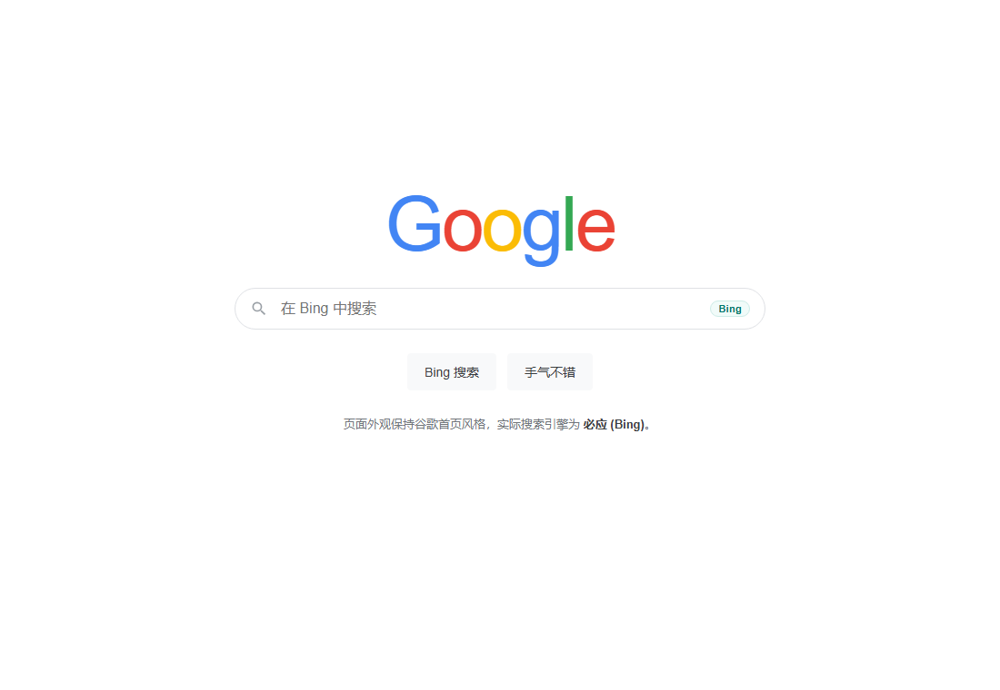

# Google 主页 + 必应搜索

> 保留谷歌搜索主页的外观，但每一次搜索都由 **必应 (Bing)** 执行。
> 一个**纯属个人兴趣**写出来的 Chrome / Edge 扩展。



**简体中文** | [English](README.en.md)

---

## 这是什么

Chrome 自带设置只能把**地址栏**和**新标签页搜索框**的搜索指向必应。但如果你在 `google.com` 页面里那个搜索框打字回车，它照样会走谷歌——因为那是网页自己发起的请求，浏览器设置管不到。

这个扩展补的就是这块缺口：**任何指向 `google.*/search?q=…` 的导航，都会在请求真正发出之前被改写成 `bing.com/search?q=…`。**

- 页面还是谷歌的样子（新标签页 / 主页仍然是 Google）
- 搜索全部走必应，**包括谷歌页面内部那个搜索框**
- 不修改你的浏览器默认搜索引擎设置，随时可以一键关掉

## 功能

| 功能 | 说明 |
| --- | --- |
| 搜索重定向 | `google.*/search?q=关键词` → `bing.com/search?q=关键词`；图片搜索 → `bing.com/images` |
| 请求级改写 | 基于 MV3 `declarativeNetRequest`，在请求发出**前**改写，不会先闪一下谷歌结果页再跳走 |
| 兜底拦截 | 内容脚本拦截搜索框提交和链接点击，覆盖规则未命中的边缘情况 |
| 新标签页接管 | 两种模式：**真实谷歌首页** / **本地仿谷歌页面**（后者不依赖谷歌服务器） |
| 一键开关 | 工具栏弹窗里随时启用/停用 |
| 参数清理 | 顺带去掉 `oq`、`sourceid`、`ie` 等谷歌残留参数，落地地址干净 |

## 截图

| 设置面板 | 本地仿谷歌页面 |
| --- | --- |
|  |  |

## 安装

### 方式一：加载已解压的扩展（推荐）

1. 下载本仓库：`Code` → `Download ZIP`，解压；或者 `git clone` 本仓库
2. 打开 `chrome://extensions/`（Edge 用户打开 `edge://extensions/`）
3. 打开右上角的 **「开发者模式」**
4. 点 **「加载已解压的扩展程序」**，选择**包含 `manifest.json` 的那一层目录**
5. 装好后点工具栏图标 → 「测试一次搜索」，正常的话会落到 `bing.com/search?q=hello+bing`

### 方式二：CRX 包

`dist/` 目录里有打包好的 `.crx`。请注意：

> Chrome 137 之后，**非 Chrome 应用商店来源的 CRX 已无法直接安装**。命令行 `--load-extension`、注册表外部安装、`External Extensions` 三种方式我都实测被拦截。CRX 更适合分发、留档或企业策略部署，本机自用请走方式一。

## 工作原理

核心是一条声明式网络请求规则（见 `rules.json`）：

```
https://www.google.com/search?q=关键词            →  https://www.bing.com/search?q=关键词
https://www.google.com/search?q=关键词&tbm=isch   →  https://www.bing.com/images/search?q=关键词
```

它用的是 `declarativeNetRequest` 的重定向能力，因此**改写发生在网络请求层**，浏览器根本不会向谷歌发出这次搜索请求。这也意味着即使你所在网络访问谷歌不稳定，搜索依然能正常落到必应。

第二层是 `content.js`：它在谷歌页面上兜底拦截搜索框的 `submit` 事件和搜索结果链接的点击。两层互为补充。

## 配置说明

点工具栏图标打开设置面板：

| 设置项 | 说明 |
| --- | --- |
| **搜索转必应** | 总开关，关闭后恢复原生谷歌行为 |
| **新标签页 / 主页 → 真实谷歌首页** | 新标签页跳转到 `https://www.google.com/`（默认） |
| **新标签页 / 主页 → 本地仿谷歌页面** | 显示本地页面，界面仿谷歌首页，搜索直接发给必应；**无法访问 google.com 时选它** |

## 常见问题

**Q：我需要先卸载原来的搜索引擎设置吗？**
不需要，扩展不动你的浏览器设置。

**Q：会不会影响 Gmail、Docs？**
不会。规则只匹配 `google.*/search?...`，`content.js` 也只在命中搜索页时才动作。

**Q：为什么权限看起来申请得比较多？**
`declarativeNetRequest` 的重定向规则要求扩展对**被改写的地址**拥有主机权限，所以列出了十几个常见谷歌域名。扩展不读取、更不上传任何页面内容，所有处理都在本地完成，也没有任何联网上报。

**Q：为什么图片搜索有时变成必应网页搜索？**
只有形如 `/search?q=xx&tbm=isch`（`q` 在前）的地址会被转到 `bing.com/images`；参数顺序不同时会退化为必应网页搜索。要补的话照 `rules.json` 的格式再加一条规则即可。

**Q：为什么主页没被自动设成谷歌？**
`chrome_settings_overrides.homepage` 在解压安装场景下可能被浏览器忽略（上架应用商店才需要域名所有权验证）。手动设一下即可：设置 → 外观 → 显示主页按钮 → 自定义主页填 `https://www.google.com/`。

## 调研：为什么不用现成的

做之前我把 GitHub 翻了一遍，**没有找到符合需求的现成方案**：

- 最接近的 [HotlineBing](https://github.com/StefanSokic/HotlineBing) 会把谷歌**整个页面**都替换掉，而且是 Manifest V2 老规范；
- [SwapSearch](https://github.com/harish-chary/SwapSearch)、[SearchBar](https://github.com/minxuanz/SearchBar) 这类需要**手动点一下**才换引擎；
- [chrome-search-extras](https://github.com/tranc99/chrome-search-extras) 只是在谷歌页面上**并列加**一个必应入口；
- 其余大多是反向的 “Bing → Google” 重定向。

完整调研清单见 [docs/RESEARCH.md](docs/RESEARCH.md)。

## 免责声明

**本项目纯粹出于个人兴趣编写，仅用于技术学习与交流。**

- **未上架声明**：本扩展**从未提交、也未通过 Chrome 应用商店（Chrome Web Store）的审核**，不是已上架扩展，也不在任何商店分发。
- **可用性声明**：由于 Chrome 对扩展安装来源限制严格，本扩展**可能无法安装，或安装后无法完全正常使用**；也可能因浏览器更新、谷歌页面改版、必应调整接口等原因而部分或全部失效。**使用过程中出现的任何问题，作者概不负责。**
- 与 Google、Microsoft 均无任何隶属或合作关系；文中出现的商标、产品名称归各自所有者所有。
- 本扩展只在本机改写你自己的浏览器请求，不收集、不存储、不上传任何数据，也不包含任何统计或追踪代码。
- **严格禁止**将本扩展用于：任何形式的**盈利行为**（商业销售、付费分发、捆绑进商业产品等）；**攻击或侵害他人**（入侵、扫描、干扰他人系统/网络/账号/数据等）；绕过内容过滤、欺诈、骚扰、传播违法信息等一切**不正当或违法行为**。违反者后果自负。
- 请遵守你所在地区的法律法规以及相关网站的服务条款。

完整版本（中英双语，含完整的审核状态说明与使用禁令清单）见 [DISCLAIMER.md](DISCLAIMER.md)。

## 许可证

[MIT](LICENSE)
